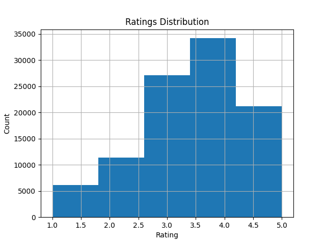

# 🎬 Movie Recommendation System

This project builds a simple *** using the [MovieLens 100k dataset](https://grouplens.org/datasets/movielens/100k/).  
It applies **collaborative filtering** (cosine similarity between movies) to suggest similar movies based on user ratings.

---

## 🔧 Tech Stack
- Python 3
- Pandas, NumPy
- Scikit-learn
- Matplotlib, Seaborn
- Jupyter Notebook

---

## 🚀 Features
- Data cleaning & preprocessing
- Exploratory Data Analysis (EDA) with plots
- User–Movie rating matrix
- Cosine similarity for recommendations
- Example: If you like *Star Wars (1977)* → suggests similar movies

---

## 📂 Project Structure
movie-recommender/
│── data/ # dataset (u.data, u.item, etc.)
│── notebooks/ # Jupyter notebooks
│ └── EDA.ipynb
│── src/ # python scripts (functions, utils)
│── images/ # saved plots
│── README.md # project description
│── requirements.txt # dependencies
---

## 📊 Example Output
Recommendations for Star Wars (1977):

The Empire Strikes Back (1980)

Return of the Jedi (1983)

Raiders of the Lost Ark (1981)

Star Trek: The Wrath of Khan (1982)

Close Encounters of the Third Kind (1977)


---

## 📊 Example Plot
Ratings Distribution:



---

## 🏃 How to Run
1. Clone this repo:
   ```bash
   git clone https://github.com/YOUR_USERNAME/movie-recommender.git
   cd movie-recommender

## Install dependencies

pip install -r requirements.txt

## Run Jupyter Notebook

jupyter notebook notebooks/EDA.ipynb

